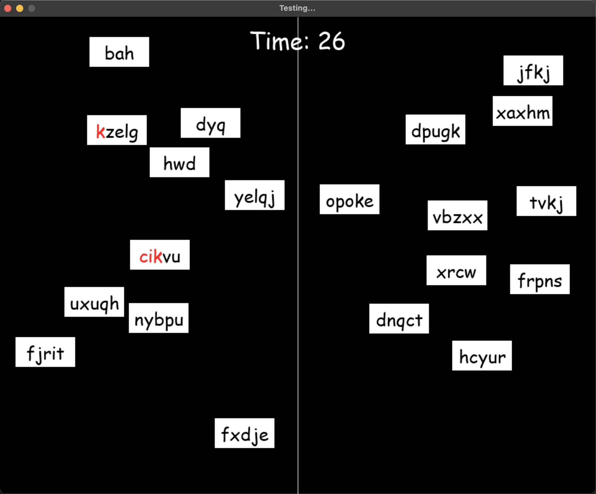

# Word Pong

A local multiplayer typing game where two players compete to type words and send them to the opponent’s side. As words fall down each player's screen, they must type them quickly to remove them and push them onto the opponent. The player with the least amount of words on their screen when the timer ends wins.

Built using Pygame for visuals and Python sockets for real-time communication.

## 🎮 Features

- Local LAN multiplayer (host and join setup)
- Real-time typing and game loop synced over network
- Dynamic word generation and collision
- Countdown timer, score tracking
- Minimal setup – runs in terminal with Python + Pygame

## 🧠 Tech Stack

- Python
- Pygame
- Socket programming (TCP)
- Threading

## 📸 Screenshots



## 🚀 Getting Started

### Prerequisites
- Python 3.9+
- `pip install pygame`

### Running Locally

1. Clone the repo:

```bash
git clone https://github.com/vaz17/wordPong
cd wordPong
```

2. Start the server:

```bash
python server.py
```

3. On both players' machines, run:

```bash
python run.py
```

- One machine hosts (`localhost` or private IP), the other joins
- Adjust `config.py` if needed for host IP

## 🧩 Folder Structure

- `server.py`: Handles player connection and sync
- `run.py`: Main game logic
- `game.py`: Player control, rendering, collision
- `network.py`: Networking utilities

## 📚 Learning Goals

- Practice with real-time networked gameplay
- Understand Pygame rendering + event loop
- Build a full working game start to finish

## 📄 License

MIT — free to use, modify, or learn from.
